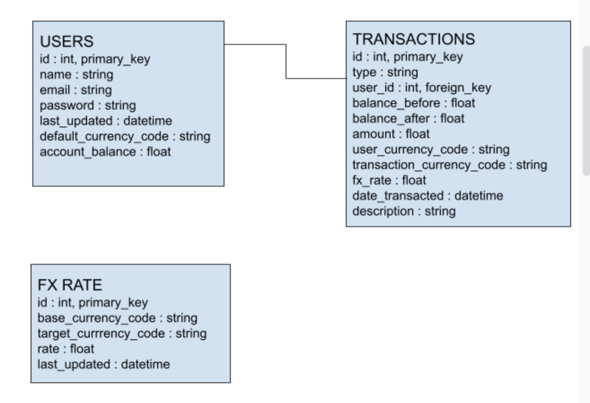

# Currency Exchange

This is an application to demo basic transactions.
It has the following functionality
1. Deposit via Mobile Money (WIP)
2. Withdraw via Mobile Money (WIP)
3. Send to another user in any currency
4. View your transactional history
5. User creation, authentication and update.

## TOOLS USED
The app is built using 
1. Python3.8 Programming language
2. Flask web framework. This come with the Jinja templating language
3. MySQL Database 
4. Docker containerization
5. Git and Github for version control.
6. Github Actions as the Continuous Integration tool
7. Google Cloud Platform App Engine Flex for running the production application
8. Google Cloud Scheduler for running cron jobs
9. Gunicorn web server

The external API used for currency conversion is https://fixer.io. 

## DATABASE DESIGN


The app uses 3 database tables:
1. Users - This table stores information about people logging into the platform
2. Transactions - This table stores data about funds moving in and out of a user wallet
3. FxRate - This table stores data on conversion of currency amongst the various currencies, say KES to USD

The users table has a one to many relationship with the transactions table using the user_id field on the transactions table.

The tables are represented as python objects using SQLAlchemy. CRUD operations are done using the SQL Alchemy ORM.

## Steps to Run

If you have docker installed change to the root direcotry and do
```shell
docker build -t currencyexchange .
docker run -dp 5000:5000 currencyexchange
```

Deploy your cron jobs on Google Cloud Platform. You need to have authenticated and selected a project
```shell
gcloud init
gcloud app deploy cron.yaml
```

If running on a local development environment:

Requirements
1. python 3.8
2. MySQL Database. If you don't have one then SQLite can be used too

Install required python libraries
```shell
pip install requirements.txt
```

Create envrionment variables required to run
```shell
export FLASK_APP=currencyexchange
export FLASK_DEBUG=1
export SECRET_KEY=your_secret_key 
export FIXER_SECRET_KEY=yourkeyhere # Get this from http://fixer.io. Its important for currency exchange purposes
```

Create a migration repository. This will add a migrations folder to your application.
```shell
flask db init
```

Generate an initial migration. The migration script needs to be reviewed and edited, as Alembic currently does not detect every change you make to your models. In particular, Alembic is currently unable to detect table name changes, column name changes, or anonymously named constraints. 
```shell
flask db migrate -m "Initial migration."
```

Apply the migration to the database
```shell
flask db upgrade
```

Each time the database models change repeat the migrate and upgrade commands.


Run the flask app
```shell
flask run
```

## ACCESSING SHELL
At times you may want to view or update data from the command line. Flask requires app context to operate in this environment. Similarly, environment variables have to be set.

The following script will make your life easier

```python
# Update env variables
import os
os.environ['SQLALCHEMY_DATABASE_URI'] = 'sqlite:///db.sqlite'
os.environ['FIXER_SECRET_KEY'] = 'fixer.io_secret_key'
os.environ['SECRET_KEY'] = 'secretkey'
os.environ['FLASK_ENV'] = 'development' 


# Push the app context
from currencyexchange import create_app
app = create_app()
app.app_context().push()


# Sample query
from currencyexchange.database.auth import User
User.query.all()

# Sample update user account
from currencyexchange.database.transactions import Transaction
nick = User.query.all()[-1]
nick.transact(1000, "KES", Transaction.Types.Credit, "Freebies")
```

## TESTING & CI
The app has several types of testing and code quality tools
1. Linter for validating the code syntax and formatting. For this the python package [flake8](http://flake8.pycqa.org) is used.
2. Unit tests. These are defined to ensure each feature works as expected. They are tied to models and their respective functions.
3. Integration tests. These are run on views to test out the whole user journey.

So as to not make actual api calls, we mock requests to the api library. This is by use of the [python mock library](https://realpython.com/python-mock-library/).

When code is committed and pushed to the github repository:
1. Github actions checks out the code.
2. The python requirements are installed
3. Flake8 linter is run
4. An sqlite database is created for testing
5. Pytest is used to run automated tests
6. Cloud build deploys to Google App Engine Flex

If any of the above steps fails, then the process is exited.

While the app is running, flask logs to std out and the logs can be viewed on Google Cloud Console Logs sections

## SCALING
When the app gains more users, several approaches can be used to scale:
1. Using the cache. To get foreign exchange rates, we have to do a database calls. So many database calls may make the requests slow and thus a bad user experience. Using a cache will speed up this making the experience better.
2. Using multiprocessing for some activities. This will provide a thread safe way to handle CPU intensive activities.
3. Using a document based NoSQL database. These perform better than relational db, in this case MySQL.

